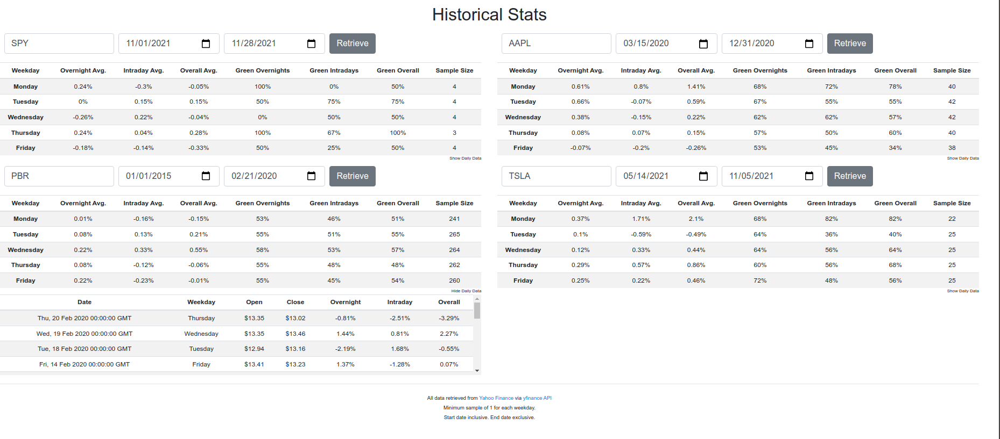

## ABOUT THE APP
App to compare stock performance based on the day of the week for any timeframe. It offers four windows to choose a stock ticker, start date, and end date. Once you hit retrieve, it generates a table with performance data based on the day of the week, along with the option to show/hide price data for every day of the timeframe.

## ABOUT THE PROJECT
This is a personal DevOps project. The primary goal is to learn and practice DevOps principles and tools. The secondary goal is to learn and practice cloud and security ops. Below is a loose draft of the progression path for this project.

- [x] Make a simple app (Flask + JS)
- [x] Containerize app (Docker)
- [ ] Create very basic CI/CD process (Jenkins or Circle CI)
- [ ] Add basic tests to CI process
- [ ] Implement public URL to the deployment
- [ ] Use K8s
- [ ] Use Vault
- [ ] Deploy CI/CD via code (Terraform)
- [ ] Make a more complex new app (BME sensor) and redo above steps
- [ ] Monitor app (Datadog)

## TO DO
- clean up HTML/CSS/JS shenanigans
- update screenshot
- create basic CI/CD process

## CHANGELOG
**v0.0.4** 11/28/2021
- Changed directory architecture
- Minor improvements

**v0.0.3**
- Created dockerfile and made app container-friendly

**v0.0.2**
- Fixed nav button path on index page

**v0.0.1**
- Very rudimentary working version of "Historical" app
    - CSS needs optimizing
    - JS needs to fix a couple makeshift solutions, secondary table dates show hours (00:00:00 GMT)
    - Python backend doesn't retrieve/provide a start price for the first day of a request

## HELPER CMDS
- docker build -t luk020/stocks-devops:latest .
- docker run --rm -p 5000:5000 stocks-devops
- docker push luk020/stocks-devops:latest

## LINKS
### Making the app
- https://github.com/luk020/stockmarket/tree/master/historical
- https://github.com/luk020/cs50-finance
- https://github.com/luk020/stocks-devops
- https://pypi.org/project/yfinance/
### Containerizing the app
- https://runnable.com/docker/python/dockerize-your-flask-application
- https://matduggan.com/are-dockerfiles-good-enough/
- https://github.com/hadolint/hadolint
- https://hub.docker.com/repository/docker/luk020/stocks-devops
### Project link ideas
- stocks-devops.lukenascimento.com
- jenkins.lukenascimento.com
- datadog.lukenascimento.com