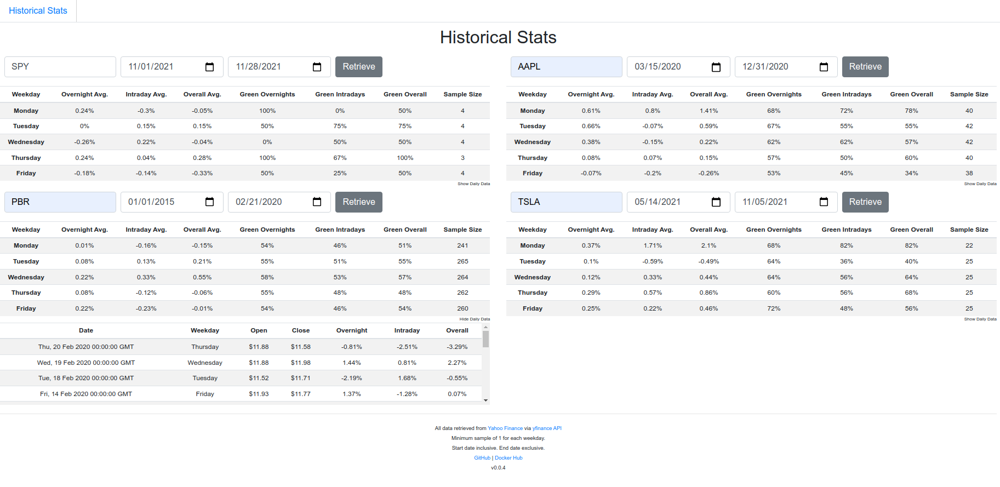

## ABOUT THE APP

Stocks-Devops compares stock performance based on the day of the week for any timeframe selected. You can select up to four combinations of stock ticker, start date, and end date to be shown in the same screen. Once you click "Retrieve", a table is generated with performance data based on the day of the week, along with the option to show/hide price data for every day of the timeframe.

## ABOUT THE PROJECT

This is a personal DevOps project. The primary goal is to learn and practice DevOps principles and tools. The secondary goal is to learn and practice cloud and security ops. Below is a loose draft of the progression path for this project.

- [x] Make a simple app (Flask + JS)
- [x] Containerize app (Docker)
- [x] Create very basic CI/CD process (Jenkins)
- [x] Use secrets management (Vault)
- [ ] Implement public URL to the deployment (Cloudflare + letsencrypt.org)
- [ ] Add basic tests to the CI (Insomnia.rest)
- [ ] Create diagram for project docs ()
- [ ] Make a more complex new app (BME sensor) and redo above steps
- [ ] Use K8s to orchestrate containers (Jenkins server, Vault, app, etc)
- [ ] Deploy K8s via code (Terraform)
- [ ] Monitor app (Grafana + Prometheus)
- [ ] Apollo for docs

## TO DO

- HTML/CSS/JS:
    - clean up shenanigans
    - create an about page
- JS: secondary table "date" column shows hours (00:00:00 GMT)
- python: handle overnight % for first day (prev. day close data)
    - start date = request start date - 1 day
    - if first day, end date = end date then continue
    - make sure rest of code isn't affected (there's a sum of days that should be affected)
- jenkins:
    - docker not using ssh key to ssh into jenkins agent container
    - clean up vault usage
        - using -dev vault server
        - root credentials saved in jenkins server
        - approle not being used, just tested
- try to create diagrams for docs
- find a use for JFrog and implement
- dabble with OpenAPI

## CHANGELOG

**v0.1.1** *12/06/2021*
- Improved docs and comments

**v0.1.0** *12/06/2021*
- Finished a simple version of CI/CD (Jenkins Multibranch Pipeline)
    - Uses local Vault -dev server to store docker credentials
    - Builds app docker image
    - Pushes to docker hub
- Vault server currently depends on ssh shell remaining open
    - CICD doc shows instructions to start server in case it stops
    - next step is containerizing Vault server and keep secrets on restart

**v0.0.4** *11/28/2021*
- Changed directory architecture
- Minor improvements

**v0.0.3**
- Created dockerfile and made app container-friendly

**v0.0.2**
- Fixed nav button path on index page

**v0.0.1**
- Very rudimentary working version of "Historical" app

## LINKS

### Making the app

- https://github.com/luk020/stockmarket/tree/master/historical
- https://github.com/luk020/cs50-finance
- https://github.com/luk020/stocks-devops
- https://pypi.org/project/yfinance/

### Project link ideas

- stocks-devops.lukenascimento.com
- apollo.lukenascimento.com